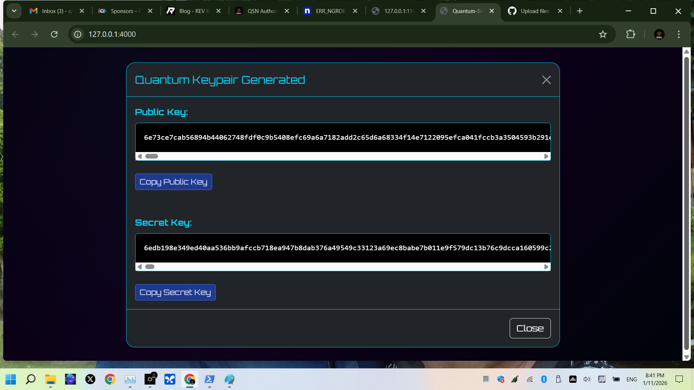

# PQC Flask Demo - ML-KEM-1024 Key Exchange

Simple proof-of-concept for post-quantum key encapsulation using the **pqcrypto** library (ML-KEM-1024 / Kyber1024 – NIST FIPS 203 standard).


### Features
- Generate quantum-resistant keypair
- Key encapsulation (encap)
- Key decapsulation (decap)
- Modern quantum-themed responsive UI with copy buttons

### Tech Stack
- Python 3.11+
- Flask
- pqcrypto (pure Python post-quantum cryptography)

### Quick Start
```bash
git clone https://github.com/QSN-Tech/pqc-flask-demo.git
cd pqc-flask-demo
pip install -r requirements.txt
python app.py


